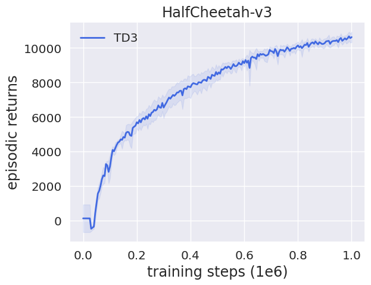
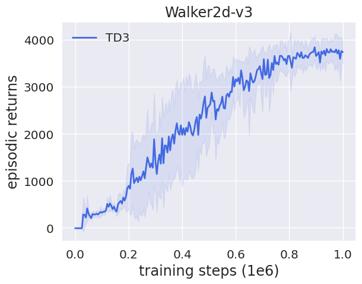
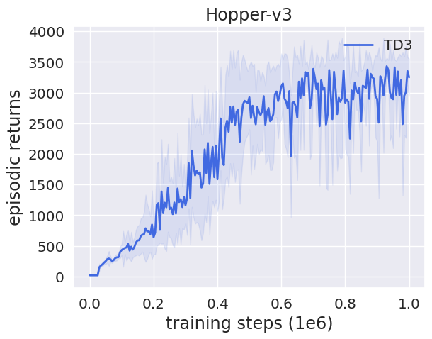
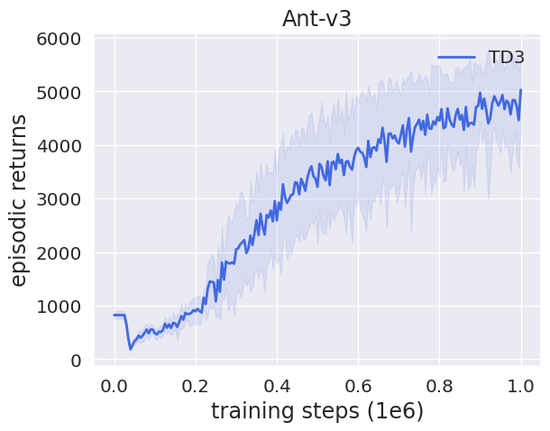

# JAX Implementation of TD3

[JAX](https://github.com/google/jax) implementation of Twin Delayed Deep Deterministic Policy Gradients (TD3) [paper](https://arxiv.org/abs/1802.09477).

This code attempts to turn the PyTorch implementation from the [original TD3 repository](https://github.com/sfujim/TD3) into JAX implementation while making minimal modifications. Training runs about two times as fast as the original PyTorch code on a i7-6700K+GTX-1080 machine. 

Method is tested using jaxlib 0.1.61, [flax](https://github.com/google/flax) 0.3.0 and Python 3.9. 

Example usage:
```
python main.py --env HalfCheetah-v3
```
or
```
./run_experiments.sh
```
for full experiments.

## Example Plots

<p float="left">
  
   
  
  
</p>